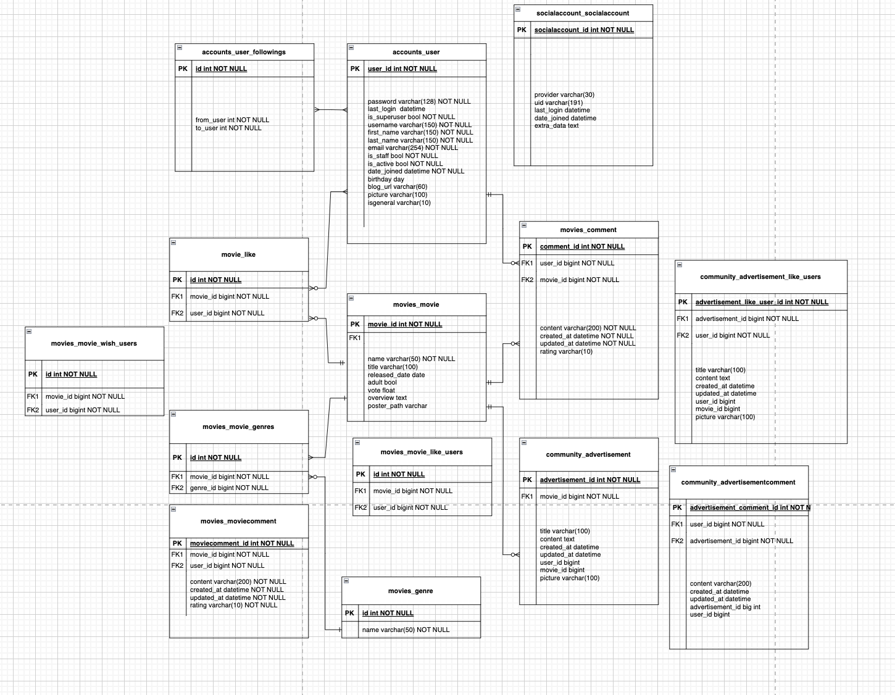

# 영화추천 프로젝트 - 일타무비

## **팀원 정보 및 업무 분담 내역**

| 역할            | 이름   | 담당 업무                                                    |
| --------------- | ------ | ------------------------------------------------------------ |
| 팀장, Driver    | 최혁주 | Bootstrap 활용하여 사이트 내 그래픽 요소 구현 추천 알고리즘 구현 (마이무비 : 장르 평점 회귀분석 기반 영화 추천) 페이지간 연동 작업(accounts - movies - community) JavaScript 활용하여 동적 페이지 제작 |
| 팀원, Navigator | 손승운 | 소셜 로그인 구현 추천 알고리즘 구현 (장르 어답터 : KOBIS 웹 크롤링 데이터 기반 최신 유행 장르 영화 추천) community CRUD |

## **목표 서비스 구현 및 실제 구현 정도**

- 서비스 목표 : TMDB(The Movie Database)로부터 영화 데이터를 수집하여 영화에 관한 정보와 함께 다양한 추천 알고리즘을 활용한 유의미한 영화 추천 서비스를 제공하고, 커뮤니티에서 회원간에 영화에 나온 아이템이나 장소를 가지고 소통할 수 있는 장을 제공한다.
- 개발환경
  - Python 3.8 +
  - Django 3.2.12
- 도구
  - Visual Studio Code
  - Chrome Browser
- 아키텍처
  - Django & VanillaJS

### 프로젝트 구조

- accounts
  - 회원 가입
    - 프로필 사진 등록 가능 (등록하지 않아도 무방)
      - 프로필 > 프로필 편집에서 사진변경 가능
    - 회원 유형을 구분하여 받음
      - 판매회원 : 영화 관람객을 대상으로 물건을 판매하는 회원
      - 일반회원 : 영화를 관람하기 전에 정보를 얻거나, 영화를 관람하고 난 후 다른 관람객들과 리뷰를 비교하고 소통하기 위해 가입한 회원
    - 소셜 로그인 구현(구글, 네이버)
      - 소셜 로그인 회원은 일반 회원으로 간주
  - 프로필
    - 회원 유형에 따라 보여지는 화면이 달라짐
      - 일반회원 : 마이무비 (회원이 평가한 영화, 보고싶어 하는 영화)
      - 판매회원 : 씨네마켓 (회원이 판매중인 제품 목록)
    - 팔로우, 팔로잉 기능
      - ‘팔로워’ 글자를 눌러 현재 내 팔로워 목록을 모달 창에서 확인 가능
      - ‘팔로잉' 글자를 눌러 현재 내 팔로잉 목록을 모달 창에서 확인 가능
      - 팔로우, 언팔로우 버튼을 누르면 화면과 DB에 즉각적으로 반영(JavaScript 활용)
- movies
  - 홈 화면
    - 회원에게는 5가지의 보기 기능이 주어짐 (아래 필수기능 설명 -> 추천 알고리즘에서 상세히 설명)
      - 마이무비
      - 지금의 영화
      - 이달의 영화
      - 오늘의 영화
      - 장르 어답터
  - 영화 상세페이지
    - 판매회원은 판매회원에게만 보이도록 설정해 놓은 ‘홍보하기’ 버튼을 통해 영화와 관련된 제품을 등록할 수 있음 (사진 등록 가능)
    - 유저는 영화에 관한 리뷰를 댓글을 통해 남길 수 있음
      - 1~5점 평점 등록 가능 (’마이무비’ 추천 알고리즘에 평점 데이터 활용)
    - 영화에 ‘좋아요’ 누를 시 즉각적으로 상태 반영
    - ‘보고싶은 영화 추가’ 누를 시 즉각적으로 상태 반영 및 회원 프로필의 ‘보고싶은 영화’에 추가
  - 검색 기능
    - 화면 상단 navbar에서 select 옵션을 활용해 검색 유형을 선택할 수 있도록 함
      - 회원검색 : 검색창에 입력된 값과 유저 DB의 회원 이름을 비교하여, 입력값이 회원 이름 내에 포함되어있으면 user_search.html 상에 결과로 반환되어 나타남
        - ex) ‘철수’ 검색 : 김철수, 박철수, 최철수, 이철수… 결과 반환
      - 영화검색 : 검색창에 입력된 값과 영화 DB의 영화 제목을 비교하여, 입력값이 회원 이름 내에 포함되어있으면 user_search.html 상에 결과로 반환되어 나타남
        - ex) ‘ 어벤져스' 검색 : 어벤져스, 어벤져스:에이지 오브 울트론, 어벤져스:엔드게임… 결과 반환
- community
  - 씨네마켓
    - 판매회원은 일반회원들을 대상으로 영화와 관련된 제품 혹은 가게 홍보 활동을 할 수 있음
      - 중개의 대가로 일타무비는 수수료를 받음
      - 판매회원만 글 작성권한 가짐
    - 기획배경
      - 사용자의 니즈를 충족시키기 위해
        - 사용자의 니즈는 영화를 추천받는 것도 있지만 영화를 본 후 영화에 사용된 소품, 촬영된 장소를 소비하는 것도 포함
      - 웹을 개발하고 유지 하는데 필요한 비용을 충당하기 위해
        - 웹을 개발하고 유지하기 위해선 필연적으로 비용이 발생할 수 밖에 없음
        - 이용자(일반회원, 판매회원) 간 영화에 사용된 소품, 촬영된 장소 등을 거래할 수 있는 공간을 플랫폼을 개설해 수수료를 징수
    - 인스타그램과 유사한 UI 제공
    - 판매 회원은 글 작성 시 제품 사진과 판매 URL 등록 가능 (수정 가능)
    - 티빙의 티빙몰을 벤치마킹(티빙에서 방영중인 드라마, 예능에서 쓰인 소품 등을 판매)

## **데이터베이스 모델링 (ERD)**

## **필수 기능에 대한 설명**

A. 관리자 뷰

- 영화 등록 / 수정 / 삭제, 그리고 유저 관리 권한 등은 관리자만 접근 가능

B. 영화 정보

- 약 2000개의 영화 데이터 확보
- 로그인 된 유저는 상세 영화 페이지에서 댓글을 통해 평점과 리뷰를 남기고, 이를 수정/삭제할 수 있음

C. 영화 추천 알고리즘

- 마이무비 : 회원이 남긴 평점 데이터를 기반으로 아직 회원이 보지 않은 영화(평가하지 않은 영화)들 중에서 높은 평점이 예상되는 영화들을 추천
  - Content-Based Filtering
  - 영화평점을 종속변수로 하고, 장르들을 독립변수로 하여 회귀분석 진행
    - Pandas, Scikit learn 파이썬 데이터 분석 라이브러리 활용
    - L1(Lasso) 정규화
      - 분석할 수 있는 유저 데이터가 많지 않기 때문에, 회귀분석 시행 시 데이터가 있는 구간은 잘 설명하지만 데이터가 없는 구간은 잘 설명하지 못할 수 있음
      - 회귀계수들의 절댓값의 합에 규제를 가해 회귀 계수들이 종속 변수에 미치는 영향을 조절
      - 영화 평점을 예측하는 데 의미있는 장르를 도출하는 데 탁월 (Feature selection)
        - 분석에 유의한 장르들을 활용, 유의하지 않은 장르들은 자동으로 탈락
- 지금의 영화 : 각 시간대별 영화 추천 (장고 ORM 활용)
  - 0~7시 : 역사, 서부극 추천
    - 메시지 : "새벽감성... 잠이 안오시나요? 역사, 서부극 배달이요~”
  - 8~11시 : 애니메이션 추천
    - 메시지 : "하루를 영화로 시작하려는 당신! 귀여운 애니메이션 어떠세요?”
  - 12시~17시 : 스릴러, 범죄, 전쟁 추천
    - 메시지 : "점심먹고 많이 졸리시죠? 당신의 잠을 깨워줄 영화들입니다.”
  - 18~23시 : 드라마, 코미디, 로맨스, 가족 추천
    - 메시지 : "수고했어 오늘도~ 하루의 마무리를 위한 영화들입니다.”
- 오늘의 영화 : 요일별 영화 추천
  - 일 : 다큐멘터리 추천
    - 메시지 : '일요일이네요... 한 주를 차분하게 마무리 해봅시다!’
  - 월 : 판타지, 음악 추천
    - 메시지 : '극복하자 월요병! 희망찬 한 주의 시작!’
  - 화 : 액션 추천
    - 메시지 : '화요일엔 화끈한 영화로 달립시다!’
  - 수 : 미스터리, SF 추천
    - 메시지 : '이제 겨우 수요일...? 시간 왜 이렇게 안가죠. 당신의 시간을 뺏어드립니다.’
  - 목 : 공포 추천
    - 메시지 : '아직 목요일이라니... 끔찍하네요. 끔찍한 공포영화 추천드립니다.’
  - 금 : 어드벤처 추천
    - 메시지 : '기다리고 기다리던 불금이네요! 쌓여있던 스트레스 풀어봅시다~’
  - 토 : TV movies 추천
    - 메시지 : '여유로운 토요일~ TV시리즈물 어떠세요?’
- 이달의 영화 : 현재 달과 동일한 달에 개봉했던 영화들 추천
- 장르 어답터 : KOBIS(영화관 입장권 통합 전산망)의 장르분포/점유율 통계 웹 크롤링 데이터를 기반으로 최신 유행 장르의 영화 추천

D. 커뮤니티

- 영화에 나온 소품이나 음식, 의상 등과 관련하여 홍보 활동을 할 수 있는 장을 제공
  - 수수료를 받아 사이트 운영/관리 보수를 위한 재정 확보
  - 사용자 니즈 만족(판매자-소비자)

## **느낀 점**

최혁주 : 잘해낼 수 있을까하는 의구심, 팀장으로서의 부담감, 가고 있는 방향이 맞는가에 대한 걱정들과 스트레스가 이 프로젝트 동안 늘 함께했던 것 같습니다. 프로젝트가 끝이 나니 후련하기도 하고, 시간관계상 더 많은, 더 획기적인 서비스를 생각해내지 못한 것과 알고리즘을 정교하게 구현해내지 못한 것에 대한 아쉬움도 있습니다.

무엇보다도 자신을 믿는 것이 참 중요하다는 것을 느꼈습니다. 내가 나를 믿지 못한다면 아무 아이템에도 도전할 수 없고, 그렇게 된다면 성공적인 프로젝트를 기대할 수 없다는 것을 알게 되었습니다. 중간중간 발생하는 에러들에 좌절도 많이 했고, 구현하고자 했던 목표를 포기하고 타협하고 싶은 생각도 들었지만, 할 수 있다고, 거의 다 왔다고 끊임없이 되뇌이며 밤낮으로 매진한 결과 오류들을 해결해낼 수 있었습니다.

앞서 언급했던 프로젝트 동안 있었던 모든 장애물들을 극복해내고 어엿한 웹 페이지를 만들어내어 완성물을 보게 되었을 때는 뿌듯함에 벅차 올랐던 것 같습니다. ‘일타무비'는 두고두고 보고싶을 결과물인 것 같습니다. 프로젝트 기간 내내 함께 고생한 승운 페어님께도 고마웠고 고생했다는 말을 전하고 싶습니다.

손승운 : 싸피 과정 내내 프로그래밍을 어려워했던 제가 ‘과연 최종 프로젝트를 수행할 수 있을까?’하는 의구심이 들었습니다. 팀 프로젝트는 팀원 하나가 제 역할을 해내지 못하면 다른 팀원들의 역할이 과중되기 때문에, 최종 프로젝트를 시작하기도 전에 제 페어인 혁주님에게 죄송하다는 생각이 들었습니다. 그 죄송하다는 마음을 조금이라도 덜어내고자 열심히 하자고 마음먹었습니다.

최종 프로젝트 전 일주일 동안 많은 생각을 하였습니다. 길을 걷다가도, 운동하는 도중에도, 친구와 연락하면서도 웹을 어떻게 구성할 것인지, 어떤 독창성을 부여할 것인지, 제가 만약 이용자라면 어떤 것을 원할 것인지를 끊임없이 고민하고 기록해 두었습니다. 이렇게 하는 것이 아직 코딩 실력이 부족한 제가 할 수 있는 최선의 노력이라고 생각했던 것 같습니다.

프로젝트를 시작하면서 페어인 혁주님과 많은 대화를 나누면서 계획이 구체화되었고, 그 속에서 저 나름의 역할을 하기 위해 노력했습니다. 처음 코드를 짤 때는 마치 사막에 혼자 덩그러니 놓여진 것처럼 막막하기만 했었지만 구글링이라는 오아시스가 있었으며, 교수님과 혁주님이라는 낙타가 있어 잘 헤쳐 나올 수 있었던 것 같습니다.

프로젝트를 수행하면서 프로그램이 제 생각처럼 따라와 주지 않아 스트레스도 많이 받았고 수면 부족에 시달렸지만 너무 즐거웠습니다. 무수한 시행착오를 거친 후 정상적으로 작동되는웹페이지를 보며, 이전에 했던 모든 고생 역시 보상받는 기분이었습니다. 그 성취감 덕분에 주말, 새벽에도 자발적으로 프로젝트를 작성했었습니다.

시간은 훌쩍 지나 프로젝트 발표 날 새벽이 되었습니다. 마지막 발표 만을 남겨두고 마무리를 하고 있는 중입니다. 프로젝트를 수행하면서 느낀 점을 작성해야 하는 시간이 되어 새벽 감성에 젖은 상태로 몇자 더 끄적여 글을 마무리 하려 합니다. 프로젝트를 진행하면서 많은 어려움을 겪었지만 그것을 해결해나가는 과정이 너무 즐거웠습니다. 주말, 밤 낮 가릴거 없이 진행된 그 시간 모두가 소중한 시간이었습니다. 그동안 저희 가르치느라 고생하신 교수님, 챙겨주신 프로님, 응원하고 도와주신 구미 3반 친구들 모두에게 감사하다는 말을 꼭 전하고 싶었습니다. 감사합니다!!! 이만 총총